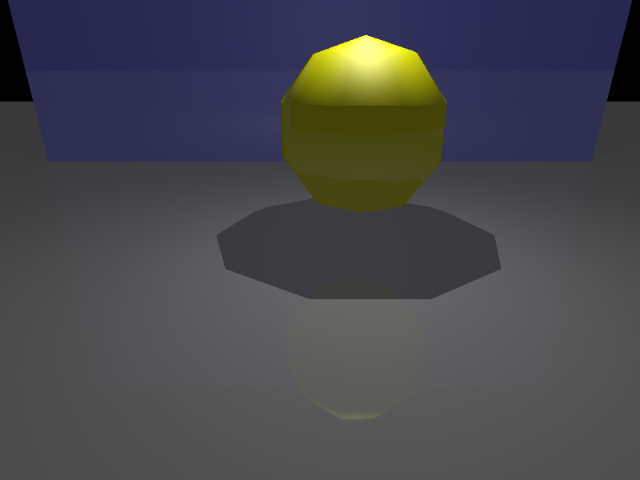
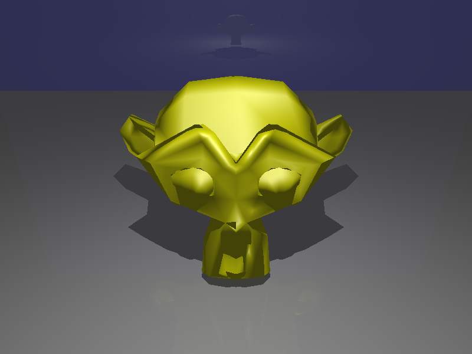
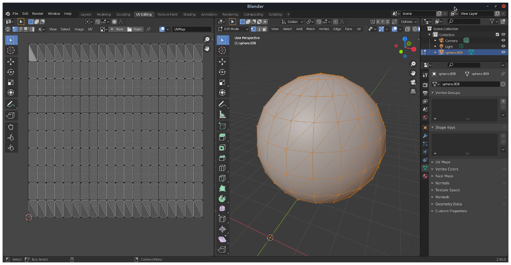
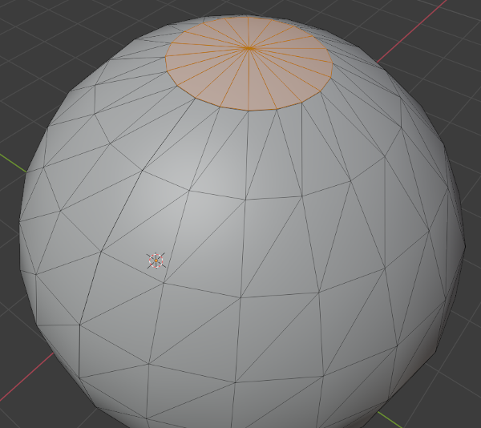
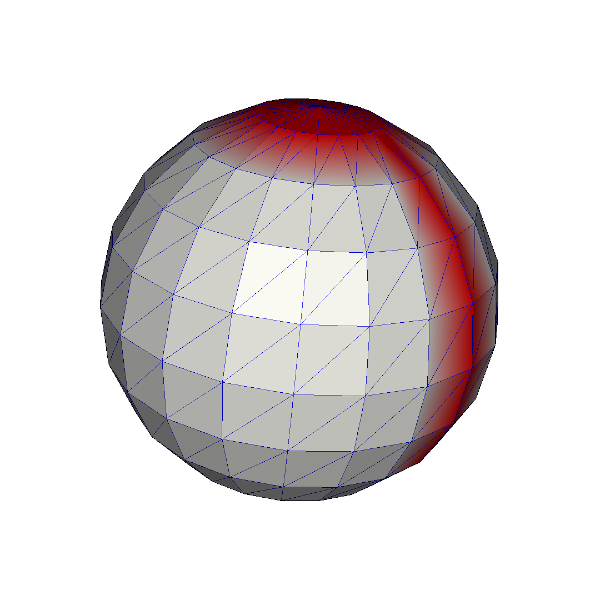
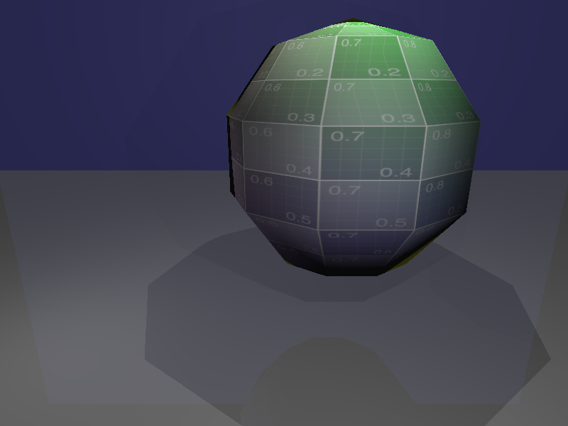
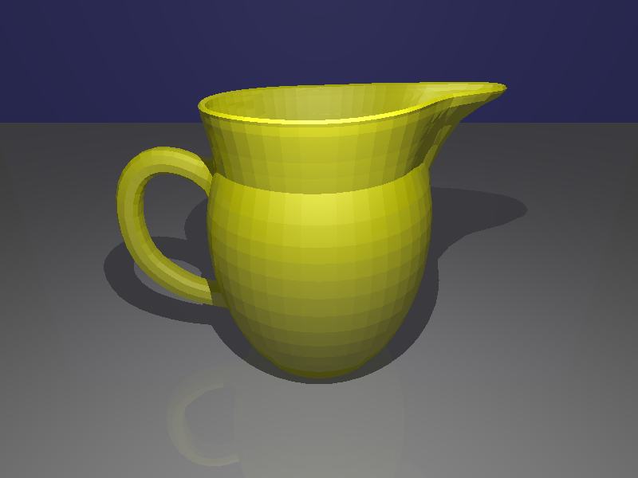
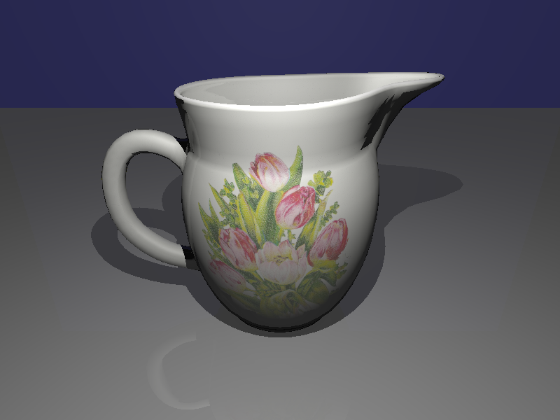
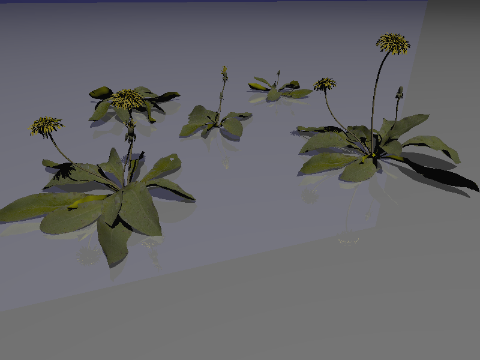

## Question 1: Antialiasing [15 points]

Add support for antialiasing as discussed in class (1006_reflection_refraction.pdf) and the textbook:

  1. Update `src/rtbasic/main.cc` to accept a new integer command line argument "-a" ("--samples_per_pixel") for the number of samples per pixel to be used for antialiasing.

  2. Add a new function `RayTracer::SetNumSamplesPerPixel()` (and any required data members) to set the number of samples per pixel for the ray tracer class.

  3. Modify `RayTracer::Render()` to generate multiple random rays through each pixel. When the number of samples per pixel is 1, the ray should always pass through the center of the pixel.

## Question 2: TriMesh [60 points]

1. [30 points] Implement TriMesh's `Hit, RayFaceHit, Save, Load, GetBoundingBox, ComputeFaceNormals, ComputeVertexNormals` functions in `src/core/geometry/trimesh.cc`, as discussed in class:
    - `ComputeFaceNormals, ComputeVertexNormals`: the computed face and vertex normals should be stored in the mesh using `TriMesh::set_normal()`.

    - `Load`: the `Load` function should be able to load face normals, vertex normals, or 2D vertex texture coordinates, if the file contains them. If the loaded mesh does not contain face or vertex normals, the function should compute them.

    - `GetBoundingBox`: For an example of how to implement `TriMesh::GetBoundingBox()`, see implementation of `SurfaceList::GetBoundingBox()` or `Triangle::GetBoundingBox()`.

2. [10 points] Update the scene parser (`src/core/parser/raytra_parser.cc`) to load triangle meshes with the `w` command. Verify that you can correctly render:

`data/scenes/sphere_mesh.scn`:



and `data/scenes/suzanne.scn`:



3. [20 points] In `src/mesh_gen/main.cc`, implement `BuildWatertightSphere(center, radius, grid_nx, grid_ny)` and `BuildSphereWithTexCoords(center, radius, grid_nx, grid_ny)`. `grid_nx` and `grid_ny` specify the number of longitudinal (horizontal) and latitudinal (vertical) divisions for the grid defining the sphere, respectively.

    - `BuildSphereWithTexCoords()` will generate a sphere mesh that is not watertight but contains vertex texture coordinates. The texture coordinates for each vertex should be computed by mapping its spherical coordinates (phi, theta) to (u, v) values in [0, 1]. The v coordinates at the north and south poles should be 0 and 1, respectively. The figure below shows an Olio generated mesh with its UV map inside Blender.

      

      The mesh was generated by running the olio_mesh_gen executable with:
      `<olio_mesh_gen> -s 0 -m 20 -n 10 -o sphere.obj`

    - `BuildWatertightSphere()` should create a sphere with no boundary vertices, edges, or faces. The mesh will also not contain any texture coordinates. Similar to the "seamless" cylinder example in the class notes, you can create such a mesh by first building the sphere with all its faces except the ones connecting to the poles. You can then add each pole cap to the rest of the faces as a triangle fan.

      

      You can check if your mesh is watertight by coloring boundary vertices with a different color and saving the mesh with vertex colors in PLY format; e.g.,

      ```
      TriMesh::Ptr mesh = BuildWatertightSphere(center, radius, 10, 10);
      mesh->request_vertex_colors();
      for (auto vit = mesh->vertices_begin(); vit != mesh->vertices_end(); ++vit) {
        TriMesh::Color vert_color{255, 255, 255};
        if (mesh->is_boundary(*vit))
          vert_color = TriMesh::Color{255, 0, 0};
        mesh->set_color(*vit, vert_color);
      }
      OpenMesh::IO::write_mesh(*mesh, "sphere.ply", OpenMesh::IO::Options::VertexColor);

      ```

      You can then view your mesh on Codio with `mesh_view`:

      `mesh_view sphere.ply`

      Boundary faces will be highlighted in red:

      

The final meshes that are generated by the `olio_mesh_gen` executable should contain vertex normals and should NOT contain any vertex colors. The normals should be unit length.

## Question 3: Texture mapping [45 points]
### 1. FaceGeoUV [20]

* Implement the `FaceGeoUV` class (in `src/core/face_geouv.h` and `src/core/face_geouv.cc`), as discussed in class.

* Update `HitRecord` (in `src/core/ray.h`) to also contain a FaceGeoUV data member and functions to set and get its value.

* Modify `Surface::Hit()` for these surface types to compute and record the FaceGeoUV at the hit point:
  * Sphere:
    - face_id_: -1
    - uv_: (-1, -1)
    - global_uv_: spherical coordinates of the hit point mapped to the [0,1] range

  * Triangle:
    - face_id_: 0
    - uv_: uv value returned by the `Triangle::RayTriangleHit()`
    - global_uv_: (-1, -1)

  * TriMesh:
    - face_id_: intersected (hit) triangle's id in mesh
    - uv_: uv value returned by the `Triangle::RayTriangleHit()`
    - global_uv_: if mesh has texture coordinates, the interpolated vertex texture coordinates using hit point's barycentric coordinates; otherwise, (-1, -1).

### 2. `ImageTexture::Value()` [5 points]
Implement the `ImageTexture::Value()` function (in `src/core/texture/image_texture.cc`), as discussed in class.

### 3. PhongMaterial and PhongDielectric [8 points]

Modify `PhongMaterial` so that its `diffuse_` data member is of type `Texture::Ptr` (smart pointer to a texture object). Update the existing `SetDiffuse(const Vec3r &diffuse)` member function in the class to set `diffuse_` to a SolidTexture object with color `diffuse`:
```
  diffuse_ = SolidTexture::Create(diffuse);
```

Add a new member function `PhongMaterial::SetDiffuse(Texture::Ptr diffuse)` that allows setting the diffuse value using a texture pointer.

As discussed in class, `Texture::Value()` can be used to evaluate the texture at a specific `uv` location or 3D position. Modify `PhongMaterial::Evaluate()` to evaluate the diffuse value at the hit point using `diffuse_->Value(...)`. Make sure to pass the correct uv and position to the function. Similarly, update `PhongDielectric::Scatter()` to work with the updated `diffuse_` data member (which is inherited from `PhongMaterial`); the function returns the diffuse value as the attenuation for the material.

### 4. Scene File Parser [12 points]

Add support for textured Phong materials. To do this, you'll need to add support for the image texture command `i` and textured Phong material command `n` as discussed in class; make sure to read the description of the commands in the scene file format specification document on CourseWorks (raytra_scene_file_format.pdf). The implementation for the textured Phong command will be almost identical to the command for Phong materials with solid colors, except that it will need to set the diffuse image texture for the Phong material based on the command's texture id.

Rendering `data/scenes/sphere_mesh_textured.scn` should produce this image:




## Question 4: Bounding Volume Hierarchy [25 points + 25 bonus points]

### 1. BVHNode [20 points]

Finish implementation of `BVHNode` by implementing `BVHNode::BuildBVH(std::vector<Surface::Ptr> surfaces, size_t start, size_t end, uint split_axis, const std::string &name)` and `BVHNode::Hit(...)` (in `src/core/geometry/bvh_node.cc`; see the header file for description of the function parameters). `BVHNode`, like other `Surface`-derived classes, makes use of the `AABB` class to keep track of its bounding box. It will need the class for BVH tree construction (`BVHNode::BuildBVH()`) and for ray-intersection tests (`BVHNode::Hit()`). Make sure to look at the definition and implementation of the `AABB` class (`src/core/aabb.{h,cc}`).

### 2. Scene-level BVH [5 points]
Modify the main function in `src/rtbasic/main.cc` to build a BVH of all the surfaces in the scene and use the BVH for rendering (instead of the surface list that's returned by the scene file parser).

With this change you should be able to render `data/scenes/jug_triangle_soup.scn` in a few seconds (3-4 seconds on Codio):



### 3. Mesh-level BVH [Bonus 25 points]

Implement `TriMesh::BuildBVH()`, which will build a BVH of the mesh's triangle faces and store it in a new data member `bvh_`. `TriMesh::Hit()` should then use the BVH for ray-TriMesh intersection tests if it is available. If a BVH for the triangle faces has not been built (i.e., `bvh_` is null), `TriMesh::Hit()` should test for intersections using the non-optimized implementation as before.

It is not necessary to create a new BVHNode-type class for this task. Instead, you can create a new "Surface" class (say, `BVHTriMeshFace`) that is used to represent a single TriMesh face. You can then use `BVHNode::BuildBVH()` to build `TriMesh::bvh_` from a list of BVHTriMeshFaces (one for each face of the mesh). This new surface type will need to implement (override) the `Surface::Hit()` and `Surface::GetBoundingBox()` functions it inherits. To do this, it will need to keep a handle to the mesh face it is representing and a pointer to the mesh.

With this change you should be able to render `data/scenes/jug.scn` in a few seconds (3-4 seconds on Codio):



Rendering `data/scenes/dandelion.scn` with 1 sample per pixel produces this image:



And rendering the same scene with 20 samples per pixel produces this image (notice the reduced aliasing/jaggedness in the long stems and yellow flowers):


The jug and dandelion models were downloaded from [Poly Haven](https://polyhaven.com).
